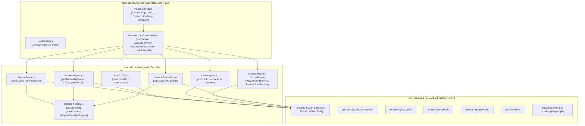

# Handoff de Engenharia — Projeto Career Mode Tracker

**Data de Emissão:** 25 de Setembro de 2026  
**Status do Projeto:** Onboarding / Handoff Concluído  
**Autores:** Equipe de Engenharia / Agente Anterior e Gemini  
**Última Etapa Validada:** Etapa 7A (Correção do Vazamento de Listeners Firestore em `useCareers`)

---

# NUNCA ACESSAR FIREBASE REAL

> [!CAUTION]
> **REGRA ABSOLUTA DE SEGURANÇA: NUNCA ACESSAR O FIREBASE REAL DE PRODUÇÃO.**  
> Qualquer operação contra o projeto de produção real causa risco imediato de corrupção ou perda irreversível de dados de usuários. Toda e qualquer interação com persistência DEVE ser direcionada exclusivamente aos emuladores locais.

### Configurações Estritas de Emulação

A infraestrutura de testes e desenvolvimento opera sob isolamento estrito:

- **Project ID Mandatório:** `demo-career-tracker-integration`
- **Firestore Emulator:** `127.0.0.1:8089`
- **Auth Emulator:** `127.0.0.1:9098`
- **Habilitação Explícita:** `TEST_EMULATOR_ENABLED=1`

### Mecanismo de Guard e Proteção de UID

- Existe no repositório o arquivo local `.env.test.guard.local` configurado com a variável `PROTECTED_USER_UID`.
- **Confirmação de Mecanismo:** O mecanismo de proteção está presente e ativo. **O valor literal deste UID NÃO é lido, copiado, impresso, nem divulgado em nenhum ponto deste documento, em logs ou em fixtures de teste.**
- O UID protegido **NUNCA** pode ser autenticado, enviado ao SDK, consultado, utilizado em seeds ou associado a fixtures.
- O arquivo `.env.local` da aplicação **NUNCA** é carregado nos ambientes de teste (o runner direciona `envDir` para arquivo regular e isolado).
- **Comportamento Fail-Closed:** A infraestrutura aborta imediatamente a execução sem qualquer tipo de fallback para nuvem caso:
  1. O Firestore Emulator estiver indisponível (`EMULATOR_UNAVAILABLE:8089`);
  2. O Project ID estiver incorreto ou não for prefixado por `demo-`;
  3. O Host do Firestore ou Auth estiver incorreto;
  4. O guard de proteção estiver ausente ou inválido (`EMULATOR_REQUIRED`).
- **Histórico Verificado:** Firebase real acessado em todas as etapas anteriores: **NÃO**.

---

## 1. Contexto Geral e Estado Atual do Repositório

Este documento consolida o conhecimento transferido entre agentes de IA para dar continuidade ao desenvolvimento, correção de bugs e otimização do projeto **Career Mode Tracker**.

### 1.1 Estado do Git e Integridade de Trabalho

- **Preservação do Trabalho Preexistente:** Há alterações em working tree provenientes de etapas anteriores e do usuário. NUNCA utilize `git reset --hard`, `git checkout .`, `git restore` amplo ou funções de Undo indiscriminadas.
- **Status do Repositório:** Verificado via `git status` e `git diff --stat`. Existem 112 arquivos com modificações ou remoções de fases anteriores, além de arquivos não rastreados de testes (`tests/`, `src/test/`), ferramentas de medição (`tests/performance/`) e documentação (`docs/`).
- **Arquivos de Produção Modificados:** Nas etapas 6F2 e 6F3, o único arquivo de produção alterado cirurgicamente foi `src/pages/Match/services/ServiceLineup/index.ts` para resolução atômica e concorrente de B16-A e B16-B. Nenhum outro arquivo de produção foi modificado.

### 1.2 Censo e Integridade de Arquivos em `src`

A auditoria da Etapa 6F1 esclareceu e validou a contagem de arquivos:

- **Total de arquivos em `src`:** **942 arquivos**
- **Arquivos de testes/fixtures em `src/test`:** **20 arquivos**
- **Arquivos de produção em `src`:** **922 arquivos** (942 total − 20 testes)
- **Reconciliação Histórica:** O snapshot antigo documentava 938 arquivos em `src` (sendo 920 de produção e 18 em `src/test`). Foram introduzidos 4 novos arquivos ao longo das etapas 6C, 6D1 e 6E:
  1. `src/layout/SectionView/features/ClubTabs/TableTab/views/AddTeamsToTable/services/ServiceTable/reconcileMatch.ts` (Etapa 6C - produção);
  2. `src/test/addSeasonFeedback.test.tsx` (Etapa 6D1 - teste);
  3. `src/common/helpers/mergeModernAndLegacy.ts` (Etapa 6E - produção);
  4. `src/test/rawPlayerEditing.test.tsx` (Etapa 6E - teste).  
     Logo: $920 + 2 = 922$ arquivos de produção e $18 + 2 = 20$ arquivos de teste, totalizando **942 arquivos** em `src`.

---

## 2. Arquitetura e Stack Tecnológica

O **Career Mode Tracker** é uma Single Page Application (SPA) para gerenciamento estatístico e acompanhamento de modos carreira de futebol.

### 2.1 Stack Técnica

- **Core:** React 18.3.1, TypeScript 5.5.3, Vite 5.4.9.
- **Roteamento:** React Router (via `@remix-run/router` 6.26.2).
- **Persistência / Auth:** Firebase SDK 12.1.0 (Firestore e Firebase Authentication).
- **Estilização e Animações:** CSS Modules, Swiper (carrosséis de abas).
- **Testes e Cobertura:** Vitest 3.2.4, V8 coverage provider, React Testing Library, jsdom.
- **Isolamento de Testes:** Firestore Boundary (`tests/integration/firestoreBoundary.ts`) intercepta o SDK real para injeção de falhas e corridas sem simulações falsas em memória.
- **Ferramental de Performance:** Playwright 1.55.1 headless, React Profiler, scripts dedicados em `tests/performance/`.

### 2.2 Estrutura de Dados e Coexistência Moderno + Legado

- **Estrutura Moderna:** Subcoleções no Firestore sob o caminho canônico `users/{uid}/careers/{careerId}/seasons/{seasonId}/...`.
  - `matches/{matchId}`: Documento de partida;
  - `matches/{matchId}/playerStats/{playerId}`: Ficha moderna de estatísticas da partida;
  - `players/{playerId}`: Documentos de elenco profissional;
  - `academyPlayers/{academyPlayerId}`: Jogadores da base;
  - `table/{tableId}`: Linhas da tabela de classificação;
  - `academyTournaments/{tournamentId}`: Torneios da base.
- **Estrutura Legada / Embutida:** No documento pai da carreira, `career.clubData[]` contém metadados de cada temporada e, historicamente, arrays embutidos pesados de `players`, `matches` e `playerStats`.
- **Regra Fundamental de Precedência (B05 e B13):**
  - **Moderno autoritativo por ID:** Se um registro com determinado ID existe na subcoleção moderna, sua representação é a única utilizada.
  - **Legado como fallback de IDs ausentes:** Registros presentes exclusivamente nos arrays legados são preservados e carregados como fallback.
  - **Helper Unificado:** Implementado no helper puro `src/common/helpers/mergeModernAndLegacy.ts`.

---

## 3. Estado Atual dos Testes e Cobertura (Checkpoint 7A)

Os números foram auditados diretamente nos relatórios oficiais e execução do pipeline completo da Etapa 7A:

- **Total de Testes Aprovados:** **384 testes**
  - Testes Unitários Aprovados: 172 (em 14 arquivos) — +8 novos testes [7A] adicionados em `src/test/useCareers.test.ts`
  - Testes de Integração no Emulator Aprovados: 212 (em 14 arquivos)
- **Regressões Pendentes (`todo`):** **0 testes**
  - B01 a B20: Todos os 20 bugs identificados encontram-se 100% corrigidos e validados.
  - Zero skips (`.skip`) e zero todos (`.todo`) ativos nas suítes funcionais.
- **Total de Arquivos de Teste:** **28 arquivos** (14 unitários + 14 integração)
- **Testes Nativos da Barreira de Segurança:** **24 testes aprovados** (15 no guard de UID/ambiente em `guard.test.cjs` + 9 no guard de isolamento de rede em `network-guard.test.cjs`, executados e contabilizados separadamente)
- **Cobertura Conjunta V8 de `src` (excluindo testes e declarações):**
  - **Lines / Statements:** **7,31%** (3.462 / 47.299 linhas)
  - **Functions:** **11,04%** (89 / 806 funções)
  - **Branches:** **48,05%** (767 / 1.596 ramos)

---

## 4. Matriz de Rastreabilidade dos Bugs (B01 a B20)

| Bug       | Descrição Sucinta                                                                                 | Status        | Etapa | Evidência / Observação                                                                                                                                                                                                  |
| --------- | ------------------------------------------------------------------------------------------------- | ------------- | :---: | ----------------------------------------------------------------------------------------------------------------------------------------------------------------------------------------------------------------------- |
| **B01**   | Premiação de Ballon d'Or duplicada na agregação de estatísticas                                   | **CORRIGIDO** |  6A   | Inicialização de acumulador em 0 em `mergeMatchStats`. Validado em `statistics.test.ts`.                                                                                                                                |
| **B02**   | Reprocessamento de dados derivados sobre a base manual (5 gols viravam 7)                         | **CORRIGIDO** |  6E   | `toRawPlayer` restaura base manual `manualStatsLeagues ?? statsLeagues` e remove tags de augmentation. Validado em `rawPlayerEditing.test.tsx` e `statistics-roundtrip.test.ts`.                                        |
| **B03**   | Data inválida (ex: `99/99`) aceita no cadastro de partidas                                        | **CORRIGIDO** |  6A   | Validação pelo calendário via `parseBrasilDate` com ano bissexto 2000 em `validateMatchForm`. Validado em `results.test.ts`.                                                                                            |
| **B04**   | Mutação no retorno de atleta recebido por empréstimo alterava contrato do chamador                | **CORRIGIDO** |  6A   | Clonagem do contrato antes de definir `dataExit` e `leftClub` em `contractHelpers`. Validado em `contracts.test.ts`.                                                                                                    |
| **B05**   | Divergência de dados entre lista, detalhe e grupo / perda de legados / homônimos                  | **CORRIGIDO** |  6E   | Precedência unificada: moderno autoritativo por ID, legado como fallback. Criação de `mergeModernAndLegacy.ts`. Homônimos tratados por IDs distintos. Validado em `sources-overlap.test.ts`.                            |
| **B06**   | Mutação no transporte de temporada acumulava contratos na temporada anterior em memória           | **CORRIGIDO** |  6A   | Cópia explícita do array `contract` no ramo de retorno em `ServiceSeasons`. Validado em `seasons.test.ts`.                                                                                                              |
| **B07**   | Criação parcial de temporada (falhas deixavam metadados e profissionais incompletos)              | **CORRIGIDO** |  6D1  | `addSeason` em `ServiceSeasons` enfileira profissionais, base e `clubData` em um único `writeBatch` atômico. Rejeição acima de 500 writes. Validado em `seasons.test.ts`.                                               |
| **B08**   | Exclusão incompleta de temporada (deixava partidas, stats, tabela e torneios)                     | **CORRIGIDO** |  6B2  | `deleteSeason` em `ServiceSeasons` enumera do servidor todas as coleções alcançáveis e deleta documento a documento antes do pai. Validado em `deletion.test.ts`.                                                       |
| **B09**   | Erro de leitura de carreira removia associação de membro do grupo                                 | **CORRIGIDO** |  6B1  | `Getters` gera `career/not-found` estritamente na ausência comprovada pelo servidor. `ServiceCareerGroup` propaga erros de rede/permissão sem limpar membros. Validado em `groups.test.ts`.                             |
| **B10**   | Promoção parcial de jogador da base (marcava promovido, mas falhava criação do atleta)            | **CORRIGIDO** |  6D2  | `AcademyService` executa promoção atômica em transação (`runTransaction`) com 3 escritas (base, profissional, `updatedAt`). Validado em `academy.test.ts`.                                                              |
| **B11**   | Falso sucesso em falha de salvamento de escalação                                                 | **CORRIGIDO** |  6A   | `useSaveLineup` retorna booleano indicando resultado real; `useLineupPersistence` só atualiza ref e chama `onSaved` sob sucesso confirmado. Validado em `persistence.test.tsx` e `feedback.test.tsx`.                   |
| **B12**   | Exclusão completa de carreira deixa descendentes órfãos históricos                                | **CORRIGIDO** |  6H   | Backend Cloud Function com `delete` recursivo do Firebase Admin SDK sob `users/{uid}/careers/{careerId}`. Falha do backend é propagada; nenhuma exclusão parcial client-side é tentada. Validado em `deletion.test.ts`. |
| **B13**   | `stripHeavyData` apagava dados embutidos legados ao criar/excluir temporadas                      | **CORRIGIDO** |  6B1  | `getCareerById` fornece callback com snapshot original antes da hidratação; `stripHeavyData` restaura dados embutidos originais de temporadas sem subcoleção. Validado em `legacy.test.ts`.                             |
| **B14**   | Remoção de pênaltis do formulário mantinha campos no Firestore devido a merge                     | **CORRIGIDO** |  6A   | `updateMatchInSeason` em `ServiceMatches` envia `deleteField()` para `homePenScore` e `awayPenScore` sob indicação explícita. Validado em `matches.test.ts` e `results.test.tsx`.                                       |
| **B15**   | Criação concorrente de temporadas partindo do mesmo estado gera subárvores órfãs                  | **CORRIGIDO** |  6G   | Transação `runTransaction` com releitura autoritativa. A primeira confirmação vence; tentativas sobre snapshot obsoleto são rejeitadas como conflito sem órfãos. Validado em `seasons.test.ts`.                         |
| **B16-A** | Falha parcial entre exclusão de fichas modernas e atualização do pai ressuscita atleta via legado | **CORRIGIDO** |  6F2  | `writeBatch` atômico unindo exclusões modernas, lineup/pai e `updatedAt`. Limite defensivo de 500 writes. Validado em `lineup.test.ts` e `lineup-characterization.test.ts`.                                             |
| **B16-B** | Remoções concorrentes de atletas em lineup sobrescrevem o pai e restauram atleta removido         | **CORRIGIDO** |  6F3  | Transação `runTransaction` com reconciliação delta sobre estado autoritativo lido. Conflitos acionam retry nativo; atletas removidos concorrentemente não ressuscitam. Validado em `lineup-characterization.test.ts`.   |
| **B17**   | Promoção concorrente duplicava atleta; repetição duplicava evento de promoção                     | **CORRIGIDO** |  6D2  | Identidade estável via `isAcademy` e `professional.academyData.id` (`academy-${source.id}`) e ID de evento determinístico `promotion:[seasonId, academyPlayer.id]`. Validado em `academy.test.ts`.                      |
| **B18**   | Editar ou excluir partida finalizada não atualizava nem revertia tabela                           | **CORRIGIDO** |  6C   | Recálculo de contadores das equipes afetadas com base nas partidas finalizadas persistidas em `ServiceTable.reconcileMatch`. Validado em `results.test.tsx`.                                                            |
| **B19**   | Repetição de resultado dobrava contadores; concorrência criava linhas duplicadas na tabela        | **CORRIGIDO** |  6C   | Transação localizada `runTransaction` em `reconcileMatch` com controle de versão documental, avanço de `career.updatedAt` e reuso de IDs. Validado em `results.test.tsx`.                                               |
| **B20**   | Campos opcionais `undefined` no payload de promoção causavam rejeição no Firestore                | **CORRIGIDO** |  6A   | `buildPromotedPlayer` omite apelido ausente; `buildPlayerAcademyTournaments` expurga propriedades `undefined`. Validado em `academy.test.ts`.                                                                           |

---

## 5. Detalhamento Crítico das Pendências (B12, B15, B16)

### 5.1 B12 — Exclusão Completa de Carreira (CORRIGIDO NA ETAPA 6H)

- **Diagnóstico Profundo:** A função `deleteCareerFromFirestore` anteriormente enumerava e removia apenas as temporadas referenciadas em `career.clubData`. Ramos históricos desvinculados dos metadados ou documentos intermediários deletados no passado (deixando descendentes como `matches`, `playerStats`, `players`) tornavam-se órfãos inacessíveis via Web SDK.
- **Implementação Realizada (Etapa 6H):**
  - Implementada a Cloud Function `deleteCareerCascade` em `functions/src/index.ts` utilizando `onCall` (`firebase-functions/v2/https`).
  - **Autenticação e Autorização:** Exige sessão autenticada (`request.auth.uid`). Rejeita chamadas não autenticadas com `unauthenticated`.
  - **Validação de Entrada:** Validação rigorosa de `careerId` (deve ser string não vazia, sem caracteres `/` ou `\`, mitigando injeção de caminho / path traversal). Rejeita inputs inválidos com `invalid-argument`.
  - **Expurgo Físico Recursivo:** Utiliza `getFirestore().recursiveDelete(careerRef)` operando sob privilégios do Firebase Admin SDK no caminho estrito `users/{uid}/careers/{careerId}`.
  - **Isolamento de Tenant e Integridade:** Exclui recursivamente subcoleções alcançáveis, subcoleções órfãs históricas e nós sem metadados, sem tocar em carreiras irmãs do mesmo usuário nem em documentos de outros usuários.
  - **Cliente Web:** Atualizado `src/common/helpers/Deleters/index.ts` para invocar a Cloud Function via `httpsCallable`. Falha do backend é propagada; nenhuma exclusão parcial client-side é tentada. Assinatura do client `deleteCareerFromFirestore(careerId)` simplificada e sem parâmetros mortos (zero warnings TS6133).
  - **Status:** **CORRIGIDO**. Validado no suite de integração `tests/integration/deletion.test.ts`.

### 5.2 B15 — Concorrência na Criação de Temporada (CORRIGIDO NA ETAPA 6G)

- **Causa Raiz Anterior:** A etapa 6D1 garantiu atomicidade de uma criação isolada via `writeBatch`. Porém, duas requisições concorrentes partindo do mesmo snapshot liam a mesma temporada base (S1), preparavam subcoleções em IDs distintos (S2-A e S2-B) e uma sobrescrevia o documento da carreira, deixando as subcoleções da outra órfãs e sem vínculo com os metadados.
- **Decisão de Domínio Aplicada:**
  - A primeira requisição que conseguir confirmar vence.
  - A requisição concorrente ou sobre snapshot obsoleto é rejeitada com erro explícito (`SeasonCreationConflictError`, `code: 'SEASON_CREATION_CONFLICT'`).
  - Zero documentos ou subcoleções órfãs gerados pela transação derrotada.
  - Nova ação após refresh explícito do estado atualizado cria com sucesso a próxima temporada.
  - Criações em carreiras diferentes procedem simultaneamente sem bloqueio.
  - Duplo clique cria exatamente uma temporada e rejeita a duplicada.
- **Implementação Realizada (Etapa 6G):**
  - Implementado `runTransaction(db, async (transaction) => { ... }, { maxAttempts: 1 })` em `ServiceSeasons/index.ts`.
  - Leitura autoritativa da carreira dentro da transação via `transaction.get(careerRef)`.
  - Validação estrita de snapshot esperado (`expectedState`) ou inferência na primeira leitura. Se `currentLatestId !== expectedLatestSeasonId` ou contagem diverge, aborta com `SeasonCreationConflictError`.
  - Tratamento de colisão no commit: contenção de concorrência (`failed-precondition`, `aborted`) verifica existência do pai: se não existe, repassa `not-found`; se existe, converte para `SeasonCreationConflictError`.
  - **Preservação de B07 e B13:** Limite de 500 writes preservado, transporte completo de jogadores, base e contratos mantido, e exatamente 1 leitura em `users/{uid}/careers/{careerId}` conservada.
- **Status:** **CORRIGIDO**.

### 5.3 B16 — Remoção da Escalação e Fichas de Estatísticas (Lineup)

A análise minuciosa da Etapa 6F1 dividiu B16 em dois problemas independentes:

#### B16-A: Falha Parcial na Remoção (CORRIGIDO NA ETAPA 6F2)

- **Causa Raiz Anterior:**
  1. As fichas modernas dos atletas removidos eram excluídas via chamadas individuais de `deleteDoc` em `M/playerStats/{playerId}`;
  2. O documento pai da partida era atualizado com `{ lineup, playerStats }` via `setDoc(..., { merge: true })`;
  3. O timestamp `career.updatedAt` era atualizado em chamada separada.
  - Sob falha entre o passo 1 e 2, a ficha moderna desaparecia mas o embutido no pai persistia, fazendo o atleta ressuscitar via fallback legado.
- **Implementação Realizada (Etapa 6F2):**
  - Implementado `writeBatch(db)` unindo todas as operações em um único commit atômico all-or-nothing:
    - `batch.delete(...)` para cada documento em `playerStats/{playerId}`;
    - `batch.set(matchRef, { lineup, playerStats }, { merge: true })`;
    - `batch.update(careerRef, { updatedAt: Date.now() })`.
  - Validação estrita do limite de 500 writes do Firestore com falha defensiva prévia caso `removedPlayerIds.length + 2 > 500`.
  - O `todo` original foi ativado e validado com sucesso (`tests/integration/lineup.test.ts`).
  - Falhas antes ou durante o commit não alteram nenhum documento; retry converge sem duplicatas; atletas preservados mantêm seus dados intactos.
- **Status:** **CORRIGIDO**.

#### B16-B: Concorrência entre Snapshots de Lineup (CORRIGIDO NA ETAPA 6F3)

- **Causa Raiz Anterior:**
  - Ambas as operações partiam de um mesmo snapshot da escalação (ex: `[A, B, C]`).
  - A Operação 1 pretendia remover `A` e gravava `[B, C]`; a Operação 2 pretendia remover `B` e gravava `[A, C]`.
  - Ambas executavam sua escrita com sucesso, mas a última gravação do pai sobrescrevia cegamente o estado com seu snapshot local obsoleto, ressuscitando o atleta removido pela operação concorrente.
- **Implementação Realizada (Etapa 6F3):**
  - Implementado `runTransaction(db, async (transaction) => { ... })` em `ServiceLineup/index.ts`.
  - A transação relê obrigatoriamente o estado mais recente e autoritativo de `matchRef` (`transaction.get(matchRef)`) e `careerRef`.
  - **Reconciliação Baseada em Delta:** extrai `currentActive` dos IDs presentes no `currentMatch.lineup` real lido do Firestore, e calcula `allowedIds` filtrando os atletas autoritativos que não pertencem ao `removedSet` da operação atual (`currentActive.filter(id => !removedSet.has(id))`).
  - As novas escalações e fichas embutidas (`nextLineup` e `nextPlayerStats`) são derivadas filtrando estritamente por `allowedIds`. Dessa forma, atletas removidos por transações concorrentes anteriores nunca são restaurados por um snapshot obsoleto da memória do cliente.
  - As fichas modernas dos atletas em `removedPlayerIds` são excluídas atomicamente via `transaction.delete(statRef)`.
  - Conflitos de gravação transacional ativam o retry automático nativo do Firestore SDK, relendo o novo estado e reaplicando a intenção de remoção como delta.
  - **Preservação Integral de B16-A:** atomicidade de todas as escritas mantida, falha parcial sem corrupção, merge de outros atletas preservado e limite defensivo de 500 writes verificado antes do início da transação.
- **Status:** **CORRIGIDO**.

---

## 6. Resumo Fiel do Baseline de Performance (Etapa 5)

> [!NOTE]
> **Nenhuma otimização de performance foi implementada no código de produção até o momento.** As etapas 4 a 6 focaram estritamente em integridade funcional e segurança de dados. O baseline abaixo constitui o referencial para futuras otimizações.

### 6.1 Problemas Estruturais de Dados e Firestore

1. **Padrão N+1 Massivo na Hidratação Global:**
   - 60 partidas (perfil small) $\rightarrow$ **60 buscas individuais de `playerStats`**;
   - 300 partidas (perfil medium) $\rightarrow$ **300 buscas individuais de `playerStats`**;
   - 900 partidas (perfil large) $\rightarrow$ **900 buscas individuais de `playerStats`** (provoca saturação e censura de timeout).
2. **Hidratação Duplicada de Player:**
   - Abertura de tela de jogador instancia `useCareers` diretamente e via `useSeasonView`, dobrando o volume de leituras:
     - Small: 134 operações lógicas e 1.554 docs entregues (vs ~67/777 no fluxo normal);
     - Medium: 626 operações lógicas e 7.506 docs entregues (vs 313/3.753);
     - Large preparado: **1.800 buscas de estatísticas iniciadas**.
3. **Leak de Listeners Firestore em Ciclos de Navegação SPA:**
   - **CORRIGIDO NA ETAPA 7A.** O hook `useCareers` foi corrigido para cancelar o listener Firestore no cleanup real do `useEffect` (tanto no unmount quanto na transição de auth). Ver `docs/performance/stage-7a-listeners.md` e `src/test/useCareers.test.ts`.
   - Antes da correção, em ciclos repetidos Careers $\rightarrow$ Group $\rightarrow$ Careers:
     - Inscrições abertas: $1 \rightarrow 2 \rightarrow 3 \rightarrow 4$ listeners simultâneos;
     - Leituras disparadas a cada avanço de `updatedAt`:
       - Small: escalada de 66 para **264 leituras**;
       - Medium: escalada de 312 para **1.248 leituras**.
   - Após a correção: cada mount/unmount mantém exatamente 1 listener ativo; sem acúmulo entre ciclos ($1 \rightarrow 1 \rightarrow 1 \rightarrow 1$). O disparo de `updatedAt` reduziu em 75% o número de leituras (Small: de 264 para 66; Medium: de 1.248 para 312).
4. **Navegação e Latência Observada:**
   - Rota mais custosa (medium, cold): **Career $\rightarrow$ Season com mediana de 13.080,7 ms** (13,08 s).
   - Perfil Large sofre saturação de conexões e timeouts censurados no limite de 30 segundos no login.
   - Rota de salvamento em partidas: spinner retorna em ~2,5 s, mas leituras de atualização em background persistem por até 21 s.

### 6.2 Diagnóstico de Bundle, Assets e Renderização

- **Bundle Monolítico:**
  - **Tamanho JS:** **5.256.697 bytes** (gzip: 1.678.953 bytes);
  - CSS: 143.231 bytes (gzip: 28.104 bytes);
  - **1 único chunk JS, 0 dynamic imports** (sem qualquer code splitting).
- **Impacto Desproporcional de `react-world-flags`:**
  - Contém 243 data URIs de bandeiras em SVG/PNG embutidos diretamente no código;
  - **3.163.670 bytes** literais de payload no arquivo JS final (**~60,2% de todo o JavaScript gerado**).
- **Assets de Imagem:**
  - Imagens de troféus em PNG em resolução original excessiva (ex: `bundesliga.png` com 3,2 MB, 1254×1254 px) transferidas para serem exibidas em miniaturas de 100×100 px.
- **Comportamento de Renderização React:**
  - O maior tempo de renderização individual observado pertence ao `SectionView` (mediana de 71,7 ms acumulados);
  - **Os custos de CPU/React estão ordens de magnitude abaixo dos segundos perdidos na camada de rede/dados do Firestore.**
  - Abas ocultas do Swiper montadas antecipadamente (7 slides simultâneos em `SectionView`, 3 em `Match`), executando cálculos e consultas desnecessárias para abas inativas.
  - Timers artificiais de 1.500 ms e 500 ms em `ComparePlayers` liberando a interface antes da disponibilidade real dos dados.
  - Full reload no navegador disparado em transições internas, destruindo o cache de memória e forçando reexecução do bundle e reautenticação.
  - Long tasks de até 7,08 segundos travando a main thread durante o parsing e hidratação de dados.

---

## 7. Ordem de Prioridades para Performance

Baseado no diagnóstico técnico de impacto causal documentado no baseline, a ordem estrita de prioridades é:

1. **P0 — Eliminação do padrão N+1 na hidratação global:** Escopo sob demanda nas consultas de partidas/estatísticas em vez de varrer todo o histórico da carreira no login/navegação (Próxima etapa: **Etapa 7B**).
2. ~~**P0 — Correção do vazamento (leak) de listeners do Firestore:** Vinculação estrita do cancelamento da inscrição (`unsubscribe`) no retorno dos efeitos React de `useCareers`.~~ **CONCLUÍDO NA ETAPA 7A** — ver `docs/performance/stage-7a-listeners.md`.
3. **P1 — Eliminação do reload forçado em navegações internas:** Substituir recargas de página completas por roteamento SPA puro mantendo estado em memória.
4. **P1 — Eliminação da hidratação duplicada em Player:** Compartilhamento de dados/contexto entre `useSeasonView` e `usePlayerPageData`.
5. **P1 — Code Splitting e Otimização do Bundle:** Divisão do bundle único em chunks assíncronos por rota (`React.lazy` / `dynamic imports`).
6. **P1 — Extração/Otimização de `react-world-flags`:** Retirar payloads de bandeiras embutidos no JS principal (carregamento dinâmico ou sprites SVG externos).
7. **P1 — Montagem sob demanda de abas ocultas:** Virtualização ou renderização lazy dos slides inativos no Swiper (`SectionView` e `Match`).
8. **P2 — Eliminação de timers artificiais:** Ajustar `ComparePlayers` para orientar loading pelo estado real dos dados, e não por relógios fixos de 1.500/500 ms.
9. **P2 — Otimização de Assets (Troféus e Imagens):** Redimensionamento e conversão de troféus para formatos modernos (WebP/AVIF).
10. **P2 — Otimizações React Seletivas:** Memoizações cirúrgicas em componentes com alta frequência de re-render sem alteração esportiva.

---

## 8. Contratos e Correções Funcionais Consolidadas

As etapas anteriores consolidaram importantes garantias e invariantes de domínio que devem ser mantidos:

- **Imutabilidade de Helpers de Contrato e Transporte:** `contractHelpers` e `ServiceSeasons` operam sobre cópias profundas de contratos, impedindo mutação indevida de objetos em memória (B04, B06).
- **Validação de Calendário:** Datas passam por validação real de calendário (`validateMatchForm`), rejeitando dias inexistentes e acomodando bissexto via ano de referência (B03).
- **Prevenção de Falso Sucesso:** Camadas de hook (`useSaveLineup`, `useLineupPersistence`) aguardam a confirmação de persistência do serviço antes de emitir callbacks de sucesso ou avançar referências salvas (B11).
- **Limpeza Atômica de Campos Opcionais:** Campos descartados (como pênaltis) utilizam `deleteField()` no Firestore em vez de omissão no payload merge (B14).
- **Segurança de Payload no Firestore:** Remoção rigorosa de campos com valor `undefined` em objetos enviados ao Firestore SDK (B20).
- **Proteção de Vínculo de Grupos:** `ServiceCareerGroup` preserva a integridade de grupos em falhas de rede ou permissão, removendo membros apenas sob confirmação explícita de `career/not-found` do servidor (B09).
- **Preservação de Dados Legados:** `stripHeavyData` recebe o snapshot pré-hidratação via callback de `getCareerById` e preserva dados exclusivamente embutidos em metadados caso não haja representação equivalente em subcoleção (B13).
- **Exclusão Completa no Escopo Alcançável:** `deleteSeason` elimina sistematicamente todas as subcoleções conhecidas antes do documento da temporada (B08).
- **Recálculo e Transação de Classificação:** `reconcileMatch` recalcula os contadores de liga a partir das partidas finalizadas persistidas e executa commit transacional coordenado entre partida, tabela e timestamp (B18, B19).
- **Atomicidade de Temporada:** Criação atômica de temporada em lote único com barreira de 500 escritas (`writeBatch`) (B07).
- **Promoção Idempotente:** Promoção atômica de base para o profissional via `runTransaction` em 3 escritas com identidade estável por `academyData.id` e eventos determinísticos (B10, B17).
- **Preservação de Ficha Manual Raw:** `toRawPlayer` restaura a base manual em `manualStatsLeagues ?? statsLeagues` sem acumular partidas finalizadas como novo input manual (B02).
- **Precedência Unificada Moderno/Legado:** Precedência por ID consolidada em `mergeModernAndLegacy.ts` e aplicada transversalmente em lista, detalhe e grupos (B05).

---

## 9. Limites Conhecidos do Sistema

- **Limite de 500 Writes do Firestore Batch:** O método `addSeason` soma 1 atualização de carreira + número de atletas profissionais + número de atletas da base. Se essa soma ultrapassar 500 escritas, a operação é rejeitada preventivamente com erro antes de tocar o banco. Não há suporte a elencos ilimitados.
- **Transação de Promoção:** Executa exatamente 3 escritas atômicas (`academyPlayers`, `players` e `career.updatedAt`).
- **Concorrência em Torneios da Base:** A enumeração de torneios da base na promoção não impede a criação concorrente de um novo torneio fora do conjunto lido durante a transação.
- **B12 (Órfãos Históricos):** O percurso do cliente Web não alcança documentos cujos ancestrais ou metadados de temporada tenham sido perdidos no passado.
- **B15 (Criação de Temporada Concorrente — Resolvido):** Resolvido na Etapa 6G via `runTransaction(..., { maxAttempts: 1 })` com rejeição de snapshots obsoletos via `SeasonCreationConflictError` e zero resíduos órfãos.
- **B16-B (Concorrência em Lineup — Resolvido):** Removido dos limites não resolvidos. Resolvido na Etapa 6F3 via `runTransaction` e reconciliação baseada em delta com retry nativo do Firestore.
- **Security Rules de Produção:** Inexistentes no repositório. As regras de teste (`firestore.test.rules`) são sintéticas e estritas ao escopo das fixtures locais.
- **Quotas Físicas do Firestore:** Limites de 1 MiB por documento e 10 MiB por requisição são aplicáveis pelo backend.

---

## 10. Diretrizes de Trabalho e Disciplina Operacional

Para qualquer intervenção futura no projeto, siga estritamente os princípios consolidados:

1. **Um Problema por Vez:** Nunca misture correções de bugs distintos, refatorações e otimizações na mesma etapa.
2. **Patch Mínimo e Cirúrgico:** Modifique a menor quantidade possível de linhas e arquivos de produção estritamente necessários para satisfazer o contrato.
3. **Teste de Regressão Primeiro:** Reproduza o defeito ou comportamento desejado com um teste automatizado antes de aplicar o patch em produção.
4. **Validação Direcionada Imediata:** Execute os testes específicos do módulo alterado antes de avançar.
5. **Validação Global no Fechamento:** Ao concluir uma etapa, execute a suíte completa de verificações (`typecheck`, `typecheck:tests`, `lint`, `test:run`, `test:integration`, `test:coverage:all`, `build`, `git diff --check`).
6. **Persistência Estrita em Emulador:** Nunca teste ou desenvolva contra bancos remotos.
7. **Preservar o Baseline Existente:** Não altere contratos, testes ou fixtures de etapas anteriores sem justificativa explícita de domínio.
8. **Sem Refatoração Oportunista:** Não "aproveite" uma intervenção para alterar estilos, renomear variáveis alheias ou reorganizar arquitetura.
9. **Não Decidir Regras de Domínio Sozinho:** Questões arquiteturais como B12 exigem aprovação explícita do usuário.
10. **Registro Verificável:** Documente alterações com hashes, diffs e relatórios detalhados ao final de cada etapa.

---

## 11. Próximos Passos Recomendados

1. **Fase de Otimização de Performance — Etapa 7B:**
   - Com a Etapa 7A (vazamento de listeners de `useCareers`) integralmente concluída e comprovada, a próxima intervenção prioritária P0 é a **Etapa 7B: Eliminação do Padrão N+1 na Hidratação Global de Estatísticas**.
   - Focar no escopo sob demanda em `Getters/index.ts` e `ServiceMatches/index.ts` para evitar carregar todo o histórico de partidas e playerStats de temporadas inativas na inicialização da aplicação.
2. **Preservação de Integridade:**
   - Manter a barreira de isolamento de rede e proteção de credenciais ativas durante todas as medições de performance.
   - Preservar os 384 testes funcionais existentes como contrato estrito de regressão.

---

## 12. Inventário de Arquivos e Recursos Principais

### Relatórios e Documentação

- `docs/testing/implementation-report.md`: Relatório mestre consolidando o histórico das etapas de implementação.
- `docs/testing/stage-6a-report.md`: Relatório das correções B01, B03, B04, B06, B11, B14 e B20.
- `docs/testing/stage-6b1-report.md`: Relatório das correções B09 e B13.
- `docs/testing/stage-6b2-report.md`: Relatório da correção de B08 e caracterização de B12.
- `docs/testing/stage-6c-report.md`: Relatório das correções B18 e B19.
- `docs/testing/stage-6d1-report.md`: Relatório da correção de B07 e caracterização de B15.
- `docs/testing/stage-6d2-report.md`: Relatório das correções B10 e B17.
- `docs/testing/stage-6e-report.md`: Relatório das correções B02 e B05.
- `docs/testing/stage-6f1-report.md`: Relatório de caracterização exaustiva de B16 (B16-A e B16-B).
- `docs/testing/stage-6f2-report.md`: Relatório de correção localizada de B16-A via `writeBatch` atômico.
- `docs/testing/stage-6f3-report.md`: Relatório de correção de B16-B via `runTransaction` e reconciliação delta.
- `docs/testing/stage-6g-report.md`: Relatório de correção de B15 via `runTransaction` e rejeição de conflito.
- `docs/testing/stage-6h-report.md`: Relatório de resolução de B12 via Cloud Function com deleção recursiva e normalização.
- `docs/performance/baseline-report.md`: Relatório completo do baseline de performance (Etapa 5).
- `docs/performance/stage-7a-listeners.md`: Relatório de correção do vazamento de listeners em `useCareers` (Etapa 7A).
- `docs/performance/methodology.md`: Metodologia, critérios e métricas de performance.
- `docs/performance/validation.json`: Registro verificável de comandos e integrações da Etapa 5.

### Infraestrutura de Testes e Segurança

- `.env.test.guard.local`: Arquivo local contendo a variável de ambiente `PROTECTED_USER_UID`.
- `src/test/emulatorGuard.ts`: Mecanismo que bloqueia conexões caso credenciais protegidas sejam identificadas.
- `tests/integration/firestoreBoundary.ts`: Interceptador de operações do SDK para injeção controlada de falhas e barreiras.
- `tests/integration/firestore.test.rules`: Regras de segurança sintéticas utilizadas pelo Firestore Emulator.
- `firebase.test.json`: Configuração de portas e emuladores locais.
- `vitest.integration.config.ts`: Configuração do Vitest para execução contra os emuladores.
- `vitest.all.config.ts`: Configuração unificada para coleta de cobertura completa (unitários + integração).
