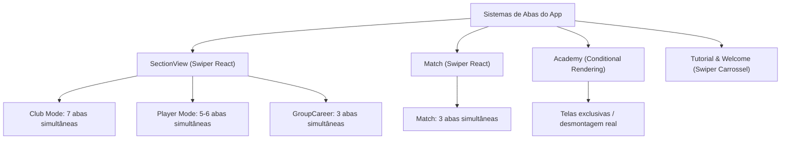

# Diagnóstico e Caracterização — Etapa 7G: Hidden Tabs, Timers e Background Work

Documento técnico de auditoria e caracterização de ciclo de vida de componentes, sistemas de abas, timers, listeners e processamento em segundo plano da aplicação.

Em conformidade estrita com as regras da etapa:

- **Nenhum código funcional foi alterado**;
- **Nenhum componente ou hook foi modificado**;
- **Nenhum teste foi alterado sem necessidade**;
- Todas as medições de runtime foram executadas exclusivamente contra **Firebase Local Emulators** e dados sintéticos via [`tests/performance/stage-7g-hidden-work.mjs`](file:///c:/Users/Hearthz%20Gaming/Desktop/pastaMae/meu/carrer-mode-tracker/tests/performance/stage-7g-hidden-work.mjs).

---

## 1. Mapa dos Sistemas de Tabs da Aplicação

_(Classificação: CONFIRMADO POR CÓDIGO)_

A aplicação utiliza essencialmente **dois motores de navegação por abas**:



| Sistema / Contexto            | Arquivo Principal                                                                                                                                                                                                                                              | Mecanismo de Renderização                        | Abas / Slides Mapeados                                                                                                                                                                                                                     |
| :---------------------------- | :------------------------------------------------------------------------------------------------------------------------------------------------------------------------------------------------------------------------------------------------------------- | :----------------------------------------------- | :----------------------------------------------------------------------------------------------------------------------------------------------------------------------------------------------------------------------------------------- |
| **SectionView (Club Mode)**   | [`src/layout/SectionView/index.tsx`](file:///c:/Users/Hearthz%20Gaming/Desktop/pastaMae/meu/carrer-mode-tracker/src/layout/SectionView/index.tsx)                                                                                                              | Swiper com `SwiperSlide`                         | 1. Elenco (`SquadTab`)<br>2. Partidas (`AllMatchesTab`)<br>3. Classificação (`TableTab`)<br>4. Estatísticas (`StatsTab_Club`)<br>5. Melhores Jogadores (`BestPlayersTab`)<br>6. Geral (`GeneralTab`)<br>7. Curiosidades (`CuriositiesTab`) |
| **SectionView (Player Mode)** | [`src/pages/Players/index.tsx`](file:///c:/Users/Hearthz%20Gaming/Desktop/pastaMae/meu/carrer-mode-tracker/src/pages/Players/index.tsx)                                                                                                                        | Swiper com `SwiperSlide`                         | 1. Jogador (`InfoPlayerTab`)<br>2. Partidas (`AllMatchesTab`)<br>3. Temporadas (`SeasonsPlayerTab`)<br>4. Estatísticas (`PlayerDetailedStatsTab`)<br>5. Total (`TotalPlayerTab`)<br>6. Base (`AcademyPlayerTab` - condicional)             |
| **SectionView (Group Mode)**  | [`src/pages/GroupCareerPage/index.tsx`](file:///c:/Users/Hearthz%20Gaming/Desktop/pastaMae/meu/carrer-mode-tracker/src/pages/GroupCareerPage/index.tsx)                                                                                                        | Swiper com `SwiperSlide`                         | 1. Elenco (`GroupSquadTab`)<br>2. Estatísticas (`StatsTab_Club`)<br>3. Melhores Jogadores (`BestPlayersTab`)                                                                                                                               |
| **Match**                     | [`src/pages/Match/index.tsx`](file:///c:/Users/Hearthz%20Gaming/Desktop/pastaMae/meu/carrer-mode-tracker/src/pages/Match/index.tsx)                                                                                                                            | Swiper com `SwiperSlide`                         | 1. Resultado (`MatchDetailsTab`)<br>2. Formações (`LineupTab`)<br>3. Estatísticas (`MatchStatsTab`)                                                                                                                                        |
| **Academy**                   | [`src/pages/Academy/layouts/AcademyContent/views/AcademyContentView/index.tsx`](file:///c:/Users/Hearthz%20Gaming/Desktop/pastaMae/meu/carrer-mode-tracker/src/pages/Academy/layouts/AcademyContent/views/AcademyContentView/index.tsx)                        | Renderização Condicional (`if (...) return ...`) | Telas mutuamente exclusivas: Dashboard, Adicionar Jogador, Adicionar Torneio, Promover Jogador, ActiveCard                                                                                                                                 |
| **Tutorial / Welcome**        | [`Tutorial/index.tsx`](file:///c:/Users/Hearthz%20Gaming/Desktop/pastaMae/meu/carrer-mode-tracker/src/pages/Tutorial/index.tsx), [`Welcome/index.tsx`](file:///c:/Users/Hearthz%20Gaming/Desktop/pastaMae/meu/carrer-mode-tracker/src/pages/Welcome/index.tsx) | Swiper simples                                   | Slides puramente visuais e estáticos (textos e formulário de login)                                                                                                                                                                        |

---

## 2. Ciclo de Vida: Quais Tabs Ficam Montadas ou Desmontadas?

_(Classificação: CONFIRMADO POR CÓDIGO E RUNTIME)_

- **SectionView (Temporada / Geral / Jogador / Grupo):**
  - **Ficam montadas simultaneamente no DOM: 100% das abas.**
  - O Swiper React instancia todos os `<SwiperSlide>` passados no array e renderiza cada `<TabComponent>` imediatamente.
  - **Nenhuma aba é desmontada ao se tornar inativa.** O Swiper apenas altera o deslocamento visual via CSS `transform: translate3d(...)`.
  - Comprovação em runtime: na tela Season, foram detectados **7 slides ativos com elementos filhos no DOM** (`totalSlidesMounted: 7`). Na tela Player, foram detectados **5 slides ativos no DOM** (`totalSlides: 5`).
- **Match:**
  - **Ficam montadas simultaneamente no DOM: 100% das 3 abas** (`MatchDetailsTab`, `LineupTab`, `MatchStatsTab`).
- **Academy:**
  - **Desmontagem real:** Utiliza `if (condição) return <Componente />`. As telas inativas são completamente desmontadas do DOM e seus hooks deixam de rodar.

---

## 3. Inventário Global de Timers

_(Classificação: CONFIRMADO POR CÓDIGO)_

Busca exaustiva em todo o código-fonte (`src/`):

| Padrão Buscado          | Ocorrências no Código | Detalhe                                                                                                                                                                                                                                                                                                                                                                                                                                                                                                                                                                                                                               |
| :---------------------- | :-------------------: | :------------------------------------------------------------------------------------------------------------------------------------------------------------------------------------------------------------------------------------------------------------------------------------------------------------------------------------------------------------------------------------------------------------------------------------------------------------------------------------------------------------------------------------------------------------------------------------------------------------------------------------ |
| `setInterval`           |         **0**         | **Nenhum `setInterval` existe no código da aplicação.**                                                                                                                                                                                                                                                                                                                                                                                                                                                                                                                                                                               |
| `requestAnimationFrame` |         **3**         | • [`SectionView/navigation/useScreenStack.ts`](file:///c:/Users/Hearthz%20Gaming/Desktop/pastaMae/meu/carrer-mode-tracker/src/layout/SectionView/navigation/useScreenStack.ts#L9) (transição de tela suave)<br>• [`Match/navigation/useScreenStack.ts`](file:///c:/Users/Hearthz%20Gaming/Desktop/pastaMae/meu/carrer-mode-tracker/src/pages/Match/navigation/useScreenStack.ts#L8) (transição de tela suave)<br>• [`useDragAndDrop.ts`](file:///c:/Users/Hearthz%20Gaming/Desktop/pastaMae/meu/carrer-mode-tracker/src/pages/CareersPage/hooks/DragAndDrop/useDragAndDrop.ts#L46) (auto-scroll durante drag de cards na CareersPage) |
| `setTimeout`            |        **15**         | Usados pontualmente para toasts temporários (3s), debounces de salvamento e pequenas animações de modal.                                                                                                                                                                                                                                                                                                                                                                                                                                                                                                                              |

### Detalhamento dos `setTimeout` Encontrados

| Arquivo                                                                                           |    Duração     | Finalidade                                         |                    Possui Cleanup?                    | Status                                       |
| :------------------------------------------------------------------------------------------------ | :------------: | :------------------------------------------------- | :---------------------------------------------------: | :------------------------------------------- |
| `src/layout/SectionView/features/ClubTabs/GeneralTab/components/CompetitionsCard/index.tsx`       |     500ms      | Debounce de salvamento ao reordenar ligas via drag |                        **NÃO**                        | **Problema menor** (se unmount durante drag) |
| `src/pages/CareersPage/components/CareerCard/hooks/useLongPressDrag/index.ts`                     |     200ms      | Detecção de long press para iniciar drag           | **SIM** (`clearTimeout` em pointer up/cancel/unmount) | Seguro                                       |
| `src/pages/CareersPage/hooks/CareerBoard/useCareerBoard.ts`                                       |     3000ms     | Fechamento automático de toast de erro             |                   Não armazena ref                    | Inofensivo (setState simples)                |
| `src/pages/Match/components/LineupTab/layouts/Section/components/SlotButton/hooks/useSlotDrag.ts` |     100ms      | Delay de ativação de drag de slot                  |       **SIM** (`clearTimer` em move/pointerup)        | Seguro                                       |
| `src/pages/ComparePlayers/hooks/useComparePlayers/index.ts`                                       | 500ms / 1500ms | Fallback de loading ao comparar jogadores          |          **SIM** (`clearTimeout` no unmount)          | Seguro                                       |
| `src/components/CustomSelect/index.tsx`                                                           |      0ms       | Fechamento de select no blur/Tab                   |                    Não necessário                     | Inofensivo                                   |
| `src/ui/modals/SeasonConfigs/ui/AcademyConfigs/index.tsx`                                         |     3000ms     | Fechamento de alerta de sucesso                    |                   Não armazena ref                    | Inofensivo                                   |

---

## 4. Inventário Global de Listeners e Observers

_(Classificação: CONFIRMADO POR CÓDIGO)_

| Tipo                                                    | Ocorrências no Código | Detalhe                                                                                                                                                                                                                                                                                                                                                                                                                                                                                                                                                                                                                                                                                                                 |
| :------------------------------------------------------ | :-------------------: | :---------------------------------------------------------------------------------------------------------------------------------------------------------------------------------------------------------------------------------------------------------------------------------------------------------------------------------------------------------------------------------------------------------------------------------------------------------------------------------------------------------------------------------------------------------------------------------------------------------------------------------------------------------------------------------------------------------------------- |
| `MutationObserver`                                      |         **0**         | Inexistente.                                                                                                                                                                                                                                                                                                                                                                                                                                                                                                                                                                                                                                                                                                            |
| `ResizeObserver`                                        |         **0**         | Inexistente.                                                                                                                                                                                                                                                                                                                                                                                                                                                                                                                                                                                                                                                                                                            |
| `IntersectionObserver`                                  |         **0**         | Inexistente.                                                                                                                                                                                                                                                                                                                                                                                                                                                                                                                                                                                                                                                                                                            |
| `onSnapshot` (Firestore)                                |         **1**         | [`src/common/helpers/Getters/index.ts`](file:///c:/Users/Hearthz%20Gaming/Desktop/pastaMae/meu/carrer-mode-tracker/src/common/helpers/Getters/index.ts#L15) (utilizado por `useCareers` para atualizar a lista de carreiras).                                                                                                                                                                                                                                                                                                                                                                                                                                                                                           |
| `onAuthStateChanged` (Auth)                             |         **4**         | • [`useCareers`](file:///c:/Users/Hearthz%20Gaming/Desktop/pastaMae/meu/carrer-mode-tracker/src/common/hooks/Career/UseCareer/index.ts#L14)<br>• [`useGroupSeasonView`](file:///c:/Users/Hearthz%20Gaming/Desktop/pastaMae/meu/carrer-mode-tracker/src/pages/GroupCareerPage/hooks/useGroupSeasonView/index.ts#L35)<br>• [`GroupCareerPage`](file:///c:/Users/Hearthz%20Gaming/Desktop/pastaMae/meu/carrer-mode-tracker/src/pages/GroupCareerPage/index.tsx#L25)<br>• [`AcademyService/helpers`](file:///c:/Users/Hearthz%20Gaming/Desktop/pastaMae/meu/carrer-mode-tracker/src/pages/Academy/layouts/AcademyContent/services/AcademyService/helpers/index.ts#L8) (`getAsyncUser`, unsubscribe imediato pós-resolução). |
| `window.addEventListener` / `document.addEventListener` |         **7**         | • `useIsMobile`: listener de `resize`<br>• `CustomSelect` / `SearchableSelect`: listener de `mousedown` para fechar fora<br>• `Modal`: listener de `touchmove`<br>• `useDragAndDrop`: listeners de drag na CareersPage<br>• `useSlotDrag`: listeners de drag na LineupTab                                                                                                                                                                                                                                                                                                                                                                                                                                               |

---

## 5. Análise de Cleanups Existentes

_(Classificação: CONFIRMADO POR CÓDIGO)_

Todos os listeners e subscriptions críticos possuem cleanups corretos implementados:

1. **`useCareers`:** Cancela tanto o listener de autenticação (`unsubscribeAuth`) quanto o listener do Firestore (`unsubscribeCareers`) no retorno do `useEffect`.
2. **`useGroupSeasonView` & `GroupCareerPage`:** Cancelam `onAuthStateChanged` com flag de montagem (`active = false`).
3. **`useIsMobile`:** Possui `return () => window.removeEventListener("resize", handleResize)`.
4. **`CustomSelect`:** Adiciona `document.addEventListener("mousedown", ...)` **apenas quando `isOpen === true`** e remove no fechamento ou unmount.
5. **`useSlotDrag`:** Adiciona listeners globais de ponteiro **apenas quando `isDragging === true`** e remove imediatamente no `pointerup` ou unmount.

---

## 6. Trabalho em Background Comprovado em Runtime

_(Classificação: CONFIRMADO POR RUNTIME — Emulators locais com fixture Small)_

| Evidência Observada                                  |      Valor Medido      | Significado                                                                                                |
| :--------------------------------------------------- | :--------------------: | :--------------------------------------------------------------------------------------------------------- |
| **Slides Swiper montados na tela Season**            |   **7 de 7 slides**    | Todas as abas são montadas e executam seu código inicial de renderização.                                  |
| **Requisições Firestore disparadas ao abrir Season** |   **14 requisições**   | 13 requisições da hidratação da temporada + **1 requisição oculta disparada por `TableTab`**               |
| **Requisições para subcoleção `/table`**             |    **1 requisição**    | `TableTab` executou `getTableBySeason` enquanto o usuário estava visualizando apenas a aba **Elenco**.     |
| **Novas requisições ao mudar para 'Partidas'**       |         **0**          | Nenhuma requisição nova (a aba já estava montada).                                                         |
| **Novas requisições ao mudar para 'Classificação'**  |         **0**          | Nenhuma requisição nova (o dado já havia sido buscado antecipadamente no background).                      |
| **Novas requisições ao mudar para 'Estatísticas'**   |         **0**          | Nenhuma requisição nova (a aba já estava montada).                                                         |
| **Abas de Jogador montadas na tela Player**          |   **5 de 5 slides**    | Todas as abas de jogador permanecem montadas no DOM.                                                       |
| **Timers ativos em runtime**                         | **0 intervals da app** | O único interval ativo no runtime pertence aos canais internos de heartbeat do SDK do Firebase/WebChannel. |

---

## 7. Problemas Reais Encontrados

### Problema Real 1: `TableTab` executa query de Firestore em background quando oculta

- **Classificação:** `CONFIRMADO POR CÓDIGO E RUNTIME`
- **Gravidade / Prioridade:** **MÉDIA-ALTA**
- **Onde ocorre:** [`src/layout/SectionView/features/ClubTabs/TableTab/hooks/useTableData/index.ts`](file:///c:/Users/Hearthz%20Gaming/Desktop/pastaMae/meu/carrer-mode-tracker/src/layout/SectionView/features/ClubTabs/TableTab/hooks/useTableData/index.ts#L43-L58)
- **Mecanismo:** Como `TableTab` é instanciada no slide 2 do Swiper logo que a temporada abre (no slide 0: Elenco), o seu `useEffect` roda imediatamente:
  ```typescript
  useEffect(() => {
    const fetchTable = async () => {
      try {
        if (career.id && season.id) {
          const data = await ServiceTable.getTableBySeason(career.id, season.id);
          setRawTableData(data);
        }
      } catch (error) { ... }
    };
    fetchTable();
  }, [career.id, season.id, career.updatedAt]);
  ```
- **Impacto Comprovado:** Em toda abertura de temporada, é disparada 1 requisição Firestore desnecessária para quem só quer gerenciar partidas ou elenco. Além disso, se `career.updatedAt` mudar durante a permanência na tela, uma nova busca é disparada mesmo que a aba esteja oculta.

---

### Problema Real 2: Renderização e cálculos pesados em abas ocultas pelo Swiper

- **Classificação:** `CONFIRMADO POR CÓDIGO E RUNTIME`
- **Gravidade / Prioridade:** **MÉDIA**
- **Onde ocorre:**
  - [`src/layout/SectionView/index.tsx`](file:///c:/Users/Hearthz%20Gaming/Desktop/pastaMae/meu/carrer-mode-tracker/src/layout/SectionView/index.tsx#L61-L81) (7 abas em Club, 5 abas em Player)
  - [`src/pages/Match/index.tsx`](file:///c:/Users/Hearthz%20Gaming/Desktop/pastaMae/meu/carrer-mode-tracker/src/pages/Match/index.tsx#L87-L104) (3 abas)
- **Mecanismo:** O Swiper mapeia todas as abas para a árvore do React:
  - `StatsTab_Club`: executa agregação de todos os jogadores da carreira (`useAggregatedPlayers`), recalcula estatísticas de partidas (`augmentSeasonWithMatchStats`), ordena listas e renderiza a lista completa de cards de jogadores (`PlayerStatsList`).
  - `BestPlayersTab`: filtra todas as partidas da temporada para ranquear jogadores e monta 8 cartões estatísticos.
  - `CuriositiesTab`: varre todas as partidas, converte datas para timestamps, calcula sequências de vitórias e mapas de minuto a minuto.
  - `GeneralTab`: inicializa sensores `@dnd-kit` e cartões de resumo.
  - `PlayerDetailedStatsTab` e `TotalPlayerTab`: calculam consolidações completas de carreira para o jogador em background.
- **Impacto:** Tempo de CPU inicial aumentado no carregamento de qualquer tela de Temporada ou Jogador (desperdício de ciclos de renderização e nós no DOM que o usuário pode nem chegar a ver).

---

### Problema Real 3: Chamada duplicada a `getAggregatedGroupStats` na tela `/Geral/Player/...`

- **Classificação:** `CONFIRMADO POR CÓDIGO`
- **Gravidade / Prioridade:** **BAIXA**
- **Onde ocorre:**
  - [`src/layout/SectionView/features/PlayerTabs/PlayerDetailedStatsTab/hooks/usePlayerStats/index.ts`](file:///c:/Users/Hearthz%20Gaming/Desktop/pastaMae/meu/carrer-mode-tracker/src/layout/SectionView/features/PlayerTabs/PlayerDetailedStatsTab/hooks/usePlayerStats/index.ts#L26)
  - [`src/layout/SectionView/features/PlayerTabs/TotalPlayerTab/hooks/useTotalPlayerData/index.ts`](file:///c:/Users/Hearthz%20Gaming/Desktop/pastaMae/meu/carrer-mode-tracker/src/layout/SectionView/features/PlayerTabs/TotalPlayerTab/hooks/useTotalPlayerData/index.ts#L31)
- **Mecanismo:** Ambas as abas usam `useGroupAggregatedPlayers(career, isGeralPage)`. Como ambas são montadas ao mesmo tempo no Swiper do jogador quando acessado a partir de Geral, se a carreira tiver `groupId`, são disparadas duas requisições paralelas ao Firestore para buscar as mesmas estatísticas de grupo.

---

### Problema Real 4: `CompetitionsCard` não cancela timeout no unmount

- **Classificação:** `CONFIRMADO POR CÓDIGO`
- **Gravidade / Prioridade:** **BAIXA (Higiene)**
- **Onde ocorre:** [`src/layout/SectionView/features/ClubTabs/GeneralTab/components/CompetitionsCard/index.tsx`](file:///c:/Users/Hearthz%20Gaming/Desktop/pastaMae/meu/carrer-mode-tracker/src/layout/SectionView/features/ClubTabs/GeneralTab/components/CompetitionsCard/index.tsx#L45-L89)
- **Mecanismo:** O ref `saveTimeoutRef.current = setTimeout(...)` com 500ms de debounce para persistir o reordenamento de ligas não possui cancelamento no `useEffect` de unmount. Se o usuário reordenar ligas e imediatamente sair da tela dentro de 500ms, a função assíncrona tenta rodar após a desmontagem do componente.

---

## 8. Falsos Positivos Importantes

_(Classificação: NÃO É PROBLEMA)_

1. **`setInterval` / Polling contínuo:**
   - **Fato:** **Não há polling** na aplicação. O único `interval` observado em runtime é o heartbeat nativo do SDK do Firebase/WebChannel.
2. **Listeners globais de redimensionamento (`useIsMobile`):**
   - **Fato:** O hook limpa o listener no unmount. Não vaza memória.
3. **Dropdowns (`CustomSelect`, `SearchableSelect`):**
   - **Fato:** O listener de `mousedown` só é adicionado ao `document` quando o dropdown está aberto (`isOpen === true`) e é removido ao fechar.
4. **Drag and Drop (`useDragAndDrop`, `useSlotDrag`):**
   - **Fato:** Os listeners globais de ponteiro (`pointermove`, `pointerup`) só são vinculados durante o arrasto ativo e são removidos ao soltar o mouse/touch.
5. **Autenticação Firebase (`useCareers`, `useGroupSeasonView`):**
   - **Fato:** Todas as inscrições chamam `unsubscribe()` no unmount.

---

## 9. Arquivos que Precisariam Mudar para Resolução Futura

1. `src/layout/SectionView/features/ClubTabs/TableTab/hooks/useTableData/index.ts` (lazy fetch da tabela)
2. `src/layout/SectionView/index.tsx` (estratégia de montagem lazy de abas no Swiper)
3. `src/pages/Match/index.tsx` (estratégia de montagem lazy de abas da partida)
4. `src/layout/SectionView/features/ClubTabs/GeneralTab/components/CompetitionsCard/index.tsx` (cleanup de timeout no unmount)
5. `src/layout/SectionView/features/PlayerTabs/PlayerDetailedStatsTab/hooks/usePlayerStats/index.ts` e `TotalPlayerTab` (eliminação da duplicação de agregação de grupo)

---

## 10. Menor Correção Recomendada para Cada Problema Real (SEM IMPLEMENTAR)

1. **Para o Problema 1 (`TableTab` fetch prematuro):**
   - **Solução mínima:** Passar uma flag `isActive: boolean` (ou verificar `activeIndex === 2`) para `TableTab` / `useTableData`, disparando `fetchTable()` somente quando a aba `Classificação` for ativada pelo usuário (ou memorizar que já foi carregada uma vez).
2. **Para o Problema 2 (Cálculos de abas ocultas no Swiper):**
   - **Solução mínima:** Implementar ativação preguiçosa (_lazy mount_) dos slides do Swiper: manter um Set ou array de abas visitadas (`visitedTabs`). Um `<TabComponent>` só renderiza seus nós filhos após o usuário navegar até ele pela primeira vez. Uma vez visitado, permanece montado para permitir o swipe suave sem refazer cálculos.
3. **Para o Problema 3 (Duplicação em Player Group):**
   - **Solução mínima:** A ativação lazy do Problema 2 já resolve automaticamente a duplicação na abertura (a aba Total só buscará se for visitada). Alternativamente, elevar a chamada de agregação para o contexto da página.
4. **Para o Problema 4 (`CompetitionsCard` timeout):**
   - **Solução mínima:** Adicionar `return () => { if (saveTimeoutRef.current) clearTimeout(saveTimeoutRef.current); }` no `useEffect` de desmontagem do componente.

---

## 11. Resumo de Prioridades dos Achados

| Achado                                 | Classificação                     |     Prioridade      | Impacto Primário                                                    |
| :------------------------------------- | :-------------------------------- | :-----------------: | :------------------------------------------------------------------ |
| **`TableTab` busca `/table` oculta**   | `CONFIRMADO POR CÓDIGO E RUNTIME` | **P1 (Média-Alta)** | Reduz 1 query Firestore desnecessária em toda abertura de temporada |
| **Todas as abas do Swiper montadas**   | `CONFIRMADO POR CÓDIGO E RUNTIME` |   **P2 (Média)**    | Economia de CPU, memória e tempo de renderização inicial no mobile  |
| **Duplicação de grupo em Player**      | `CONFIRMADO POR CÓDIGO`           |   **P3 (Baixa)**    | Previne 1 request redundante no modo grupo geral                    |
| **`CompetitionsCard` timeout cleanup** | `CONFIRMADO POR CÓDIGO`           |  **P4 (Higiene)**   | Higiene de ciclo de vida do componente                              |
| **Timers / Intervals cíclicos**        | `NÃO É PROBLEMA`                  |          —          | Zero intervalos ou loops de polling na aplicação                    |
| **Listeners globais de evento**        | `NÃO É PROBLEMA`                  |          —          | Todos limpos adequadamente                                          |
